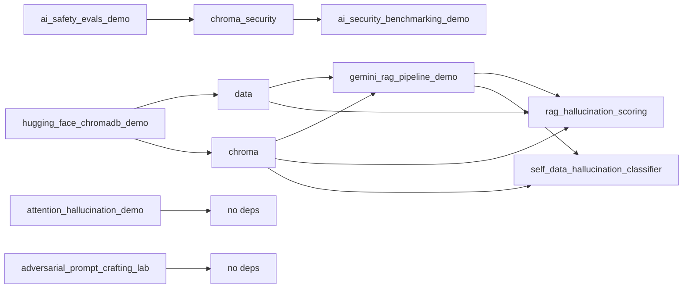

# Repository context for AI-assisted development

This file gives Claude (and other AI tools) enough context to work effectively in this repo without re-deriving structure and conventions.

## Purpose

This repository is a **personal data science and AI engineering portfolio** aimed at AmFam-relevant work. It is built on the MadData 2026 AmFam Workshop and extends it with formal AI security/safety evaluations and interactive labs. The goal is a single, coherent workspace that demonstrates RAG, vector DBs, LLM evaluation, and adversarial robustness.

## Structure

- **`foundations/`** — Two notebooks that form the core RAG pipeline. They use `../data` and `../chroma` so that when run from `foundations/`, paths resolve to repo root.
- **`explorations/`** — Includes security/safety, hallucination, **tabular fraud** (`../synthetic_data/claims_fraud_sample.csv`), **synthetic policy RAG** (`../synthetic_data/mini_auto_policy.md`, Chroma under `../outputs/chroma_synthetic_policy`), **eval logging** (`../outputs/eval_logs/rag_eval.jsonl`), and **fairness** demo. Paths assume cwd = notebook dir.
- **`walkthrough/`** — `what_we_learn_from_this_repo.ipynb` maps the whole repo for personal study.
- **`synthetic_data/`** — Fictional policy markdown + synthetic claims CSV (committed; not real insurer data).
- **`playground/`** — One standalone CTF-style notebook; no ChromaDB, only Gemini.
- **`data/`** — Gitignored. Contains `data/pdf/` (OSTEP chapter PDFs) and `data/txt/` (one folder per chapter, per-page `.txt` files). Created by `foundations/hugging_face_chromadb_demo.ipynb`.
- **`chroma/`** — Gitignored. ChromaDB persistent store for the `ostep` collection (document IDs, text, embeddings). Used by both foundation notebooks.
- **`chroma_security/`** — Gitignored. Created by explorations; holds the `attack_patterns` collection.

## Dependency chain

- **RAG:** Run `foundations/hugging_face_chromadb_demo.ipynb` first, then `foundations/gemini_rag_pipeline_demo.ipynb`.
- **Security:** Run `explorations/ai_safety_evals_demo.ipynb` first, then `explorations/ai_security_benchmarking_demo.ipynb`.
- **Hallucination/grounding:** RAG scoring and self-data classifier need foundations (chroma). Attention demo is standalone (GPT-2).
- **Playground** has no notebook or data dependencies.

## Data flow (RAG pipeline)

1. **Ingestion:** OSTEP PDFs (or existing `data/pdf/`) → PyMuPDF → `data/txt/{chapter_id}/{page}.txt`.
2. **Embeddings:** Hugging Face `sentence-transformers/all-MiniLM-L6-v2`, mean pooling, L2 norm; document ID format `{chapter_id}_{page_index}` (e.g. `threads-sema_2`).
3. **Vector store:** ChromaDB `PersistentClient(path='../chroma')`, collection name `ostep`.
4. **Retrieval:** Query returns top-k documents; gemini notebook builds context with `<SOURCE chapter_id="..." page_number="...">` tags.
5. **Generation:** Gemini generates answer; optional second call (LLM-as-judge) returns JSON `{ "is_grounded", "unsupported_claims" }`; retry up to 3 times if not grounded.

## Conventions

- **ChromaDB:**  
  - RAG: `chroma/` at repo root, collection `ostep`.  
  - Security: `chroma_security/` at repo root, collection `attack_patterns`.
- **Paths in notebooks:** All data/chroma paths are relative to repo root: from `foundations/` use `../data`, `../chroma`; from `explorations/` use `../chroma_security`.
- **Models:** Embeddings: `all-MiniLM-L6-v2`. LLM: `gemini-2.5-flash`, temperature 0 for judge and structured output.
- **Config:** `.env` at repo root: `GCP_PROJECT`, `GCP_LOCATION` for Vertex AI (and API key if not using Vertex).

## What to preserve

- Document ID scheme `{chapter_id}_{page_index}` and the `<SOURCE>` tag format in RAG context.
- ChromaDB collection names `ostep` and `attack_patterns`.
- Run order (foundations 1 → 2; explorations 1 → 2) when documenting or changing setup.
- The distinction between “foundations” (core RAG + data pipeline) and “explorations” (security/safety research) in the README and this file.

## What can change

- Adding notebooks under `foundations/`, `explorations/`, or `playground/` with the same path conventions. Hallucination-themed notebooks (RAG grounding, attention entropy/KL, self-data classifier) extend the portfolio and link to the [Hallucinations](https://github.com/A-Kuo/Hallucinations) repo’s natural metrics.
- Updating dependencies in `pyproject.toml` (e.g. newer ChromaDB, transformers).
- Extending the threat model, metrics, or defense layers in the exploration notebooks.
- README wording and portfolio narrative; keep structure and run order accurate.
